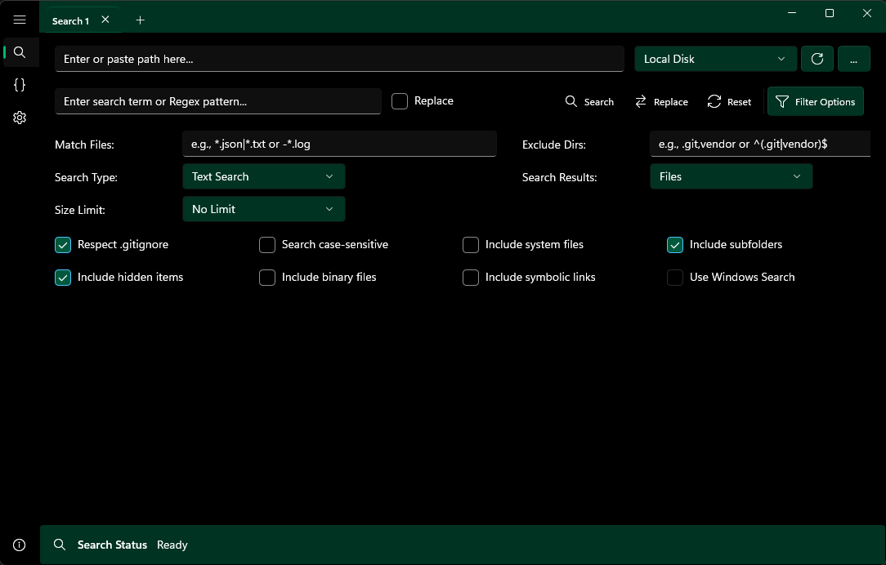
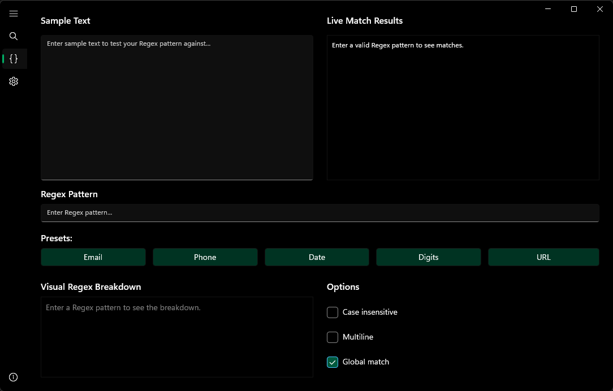
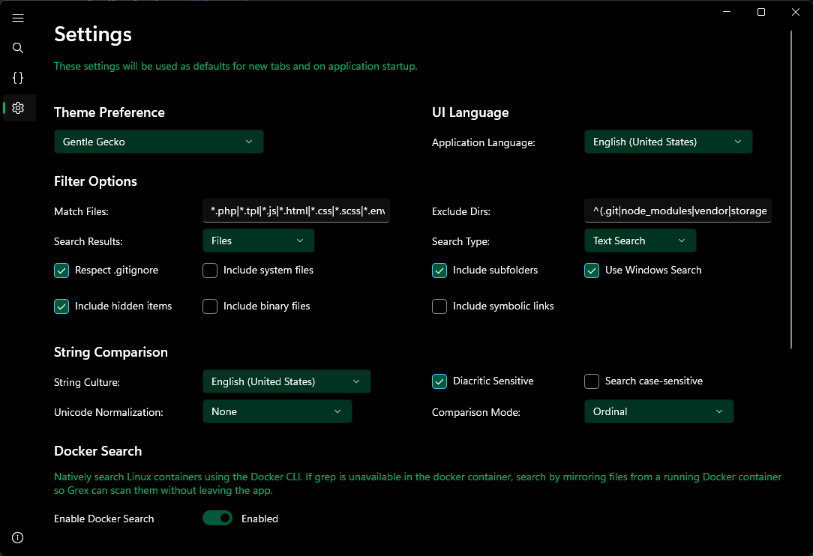

<p align="center">
  
</p>

<h1 align="center">Grex</h1>

<p align="center">
  <strong>A modern, tabbed grep experience for Windows.</strong><br>
  Search local drives, UNC shares, WSL distributions, and running Docker containers from one WinUI 3 application.
</p>

<p align="center">
  <a href="https://github.com/visorcraft/Grex/actions/workflows/ci.yml"></a>
  <a href="https://github.com/visorcraft/Grex/releases/latest"></a>
  <a href="LICENSE"></a>
  
  
</p>

<p align="center">
  <a href="#install">Install</a> |
  <a href="#quick-start">Quick start</a> |
  <a href="https://visorcraft.github.io/Grex/">Documentation</a> |
  <a href="CONTRIBUTING.md">Contributing</a> |
  <a href="SECURITY.md">Security and privacy</a>
</p>

<p align="center">
  
  
  
</p>

## Why Grex?

Grex keeps the familiar precision of grep while adding the parts that are awkward to manage in a terminal:

- Independent search tabs with persistent column and filter preferences
- Plain-text and .NET Regex matching with case, culture, Unicode normalization, and diacritic controls
- Content-line and per-file result views
- Local, UNC, WSL, and Docker search targets
- Nested `.gitignore`, filename, directory, size, hidden, system, binary, and symbolic-link filters
- Context preview, result filtering, sorting, export, history, and named profiles
- Confirmed bulk replace for Windows, UNC, and WSL paths
- Visual Regex Builder with presets, live matches, and syntax breakdown
- Optional AI chat through a user-configured OpenAI-compatible endpoint
- A Windows command-line companion, `grex-cli`

See the [feature matrix](docs/features.md) for exact behavior and boundaries.

## Install

Published builds target Windows x64. Choose an asset from the [latest release](https://github.com/visorcraft/Grex/releases/latest):

| Asset | Best for | What it does |
| --- | --- | --- |
| `grex-<version>-setup.exe` | Most users | Per-user install under `%LocalAppData%\Programs\Grex`, Start menu entry, uninstaller, optional desktop shortcut, optional `grex-cli` PATH entry |
| `grex-<version>-win-x64.zip` | Portable GUI use | Extract anywhere and run `Grex.exe`; no installer or automatic updates |
| `grex-cli-<version>-win-x64.zip` | Scripts and terminals | Extract anywhere and run `grex-cli.exe` |

Requirements:

- Windows 10 version 1809, build 17763, or later
- x64 processor for published releases
- [Windows App Runtime 1.8](https://learn.microsoft.com/windows/apps/windows-app-sdk/downloads)

Install the runtime with:

```powershell
winget install --id Microsoft.WindowsAppRuntime.1.8 -e --source winget
```

Release archives are self-contained for .NET, so the .NET SDK is not required to run them. The current installer is not code-signed, so Windows SmartScreen may ask you to confirm the download. Verify that the file came from this repository's Releases page before continuing.

Full install, update, portable, and uninstall instructions are in the [Usage Guide](docs/usage.md#install-update-or-remove-grex).

## Quick start

1. Open Grex.
2. Browse to a directory or paste a Windows, UNC, or WSL path.
3. Enter text or a Regex pattern.
4. Pick Content or Files results and set any filters.
5. Select **Search** or press Enter.
6. Select a result to preview context, open the file, filter the current results, or export them.

For replacement, enable **Replace**, enter replacement text, review the confirmation, and select **Replace**.

> Replace has no undo. Grex writes eligible files directly, and cancelling can leave files already processed changed. Commit, back up, or snapshot important data first.

### Docker

Enable Docker search in Settings, choose a running container, and enter a path inside it such as `/app`. Grex tries in-container `grep`, then falls back to a temporary host mirror when needed. Docker replacement is disabled.

### WSL

Use `\\wsl$\Ubuntu\home\user\repo`, `\\wsl.localhost\Ubuntu\home\user\repo`, or a Linux path such as `/home/user/repo`. Grex runs Linux-side search commands through `wsl.exe`. WSL replacement uses `sed -i` for eligible text files, treats replacement text literally, and is not reversible.

### CLI

The positional order is `<path> <term>`:

```powershell
grex-cli "C:\Projects" "TODO"
grex-cli "C:\src" "TODO|FIXME" --regex --gitignore --match-files "*.cs|*.xaml"
grex-cli "C:\logs" "error" --format json
```

Exit codes are grep-like: `0` for matches, `1` for no matches, and `2` for an error. See the [complete CLI reference](docs/reference.md#cli-reference).

## Optional AI chat

Grex can send a chat request to an OpenAI-compatible endpoint that you configure. It sends the current path, query, search/result modes, active filter suggestions, and chat history. It does not automatically send file contents or search results.

The API key is stored as plain text in `%LocalAppData%\Grex\settings.json` and is included in settings exports. Use HTTPS, protect backup files, and read [Security and Privacy](SECURITY.md#ai-endpoint-and-api-key) before enabling AI chat.

## Documentation

| Document | Audience and scope |
| --- | --- |
| [Public documentation](https://visorcraft.github.io/Grex/) | Start here; map of every public guide |
| [Usage Guide](docs/usage.md) | Install, search, replace, Docker, WSL, AI, settings, and troubleshooting |
| [Feature Matrix](docs/features.md) | Supported capabilities, fallbacks, limits, and target differences |
| [Technical Reference](docs/reference.md) | Shortcuts, patterns, settings schema, CLI flags, files, formats, and caps |
| [Architecture](docs/architecture.md) | Runtime design, service boundaries, flows, persistence, and dependencies |
| [Build and Test](docs/build-and-test.md) | Windows setup, build, tests, packaging, and release artifacts |
| [Translation Guide](docs/translations.md) | Resource catalogs, status tracking, scripts, review, and line endings |
| [Contributing](CONTRIBUTING.md) | Contribution workflow and repository rules |
| [Security and Privacy](SECURITY.md) | Reporting, local writes, credentials, network use, Docker, WSL, and logs |
| [Third-party notices](THIRD-PARTY-NOTICES.txt) | Redistributed components and license texts |

## Build from source

The GUI, CLI, and .NET test projects build only on Windows because the solution depends on WinUI XAML, Windows App SDK, MSIX, and PRI tooling. Use a concrete platform:

```powershell
git clone https://github.com/visorcraft/Grex.git
cd Grex
dotnet restore grex.sln
dotnet build grex.sln -p:Platform=x64
dotnet test grex.sln -p:Platform=x64
dotnet run --project Grex.csproj -p:Platform=x64
```

The Python tools in `Scripts/` are the only cross-platform build tooling. See [Build and Test](docs/build-and-test.md) before contributing.

## Support

- Search existing [issues](https://github.com/visorcraft/Grex/issues) before opening a new one.
- Include the Grex version, Windows build, target type, reproduction steps, and relevant `%Temp%\Grex.log` lines.
- Report vulnerabilities only through [private vulnerability reporting](https://github.com/visorcraft/Grex/security/advisories/new).

## License

Grex is licensed under [GNU GPL v3.0](LICENSE). Third-party components retain their own licenses as listed in [THIRD-PARTY-NOTICES.txt](THIRD-PARTY-NOTICES.txt).
